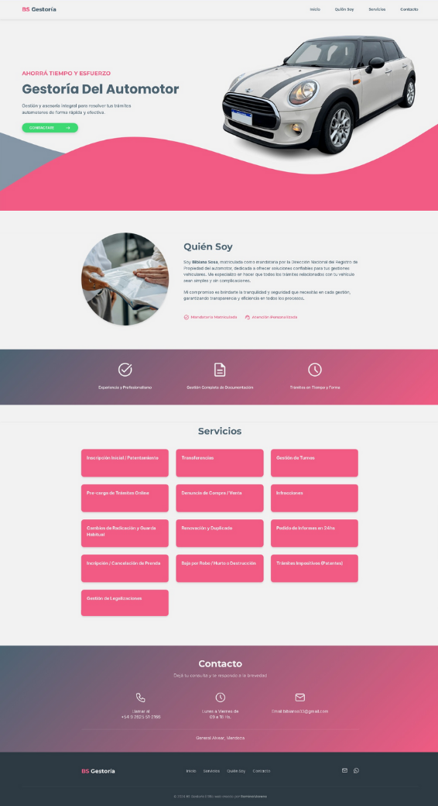

# 

Landing page profesional para la gestoría del automotor BS, diseñada para brindar información sobre los servicios ofrecidos y facilitar el contacto con clientes.

## Vista Previa 📸

## Características Principales ✨

- Diseño moderno y adaptado a todos los dispositivos.
- Sección "Quién Soy" que destaca la experiencia y profesionalismo.
- Integración con WhatsApp para contacto rápido.
- Enlaces de contacto para llamadas telefónicas y correo electrónico.
- Sección de servicios con tarjetas interactivas.

## Tecnologías Utilizadas 💻

- **HTML** para la estructura de la página.
- **CSS3** para el diseño y estilos personalizados.
- **JavaScript** para gestionar y mostrar la mayoría del contenido de manera dinámica en HTML.
- **Google Fonts** para íconos y fuentes personalizadas.

## Autor 🚀
Proyecto desarrollado por [Romina Moreno](https://www.linkedin.com/in/romina-moreno-62b479290/). 

## Contacto 📞

¡Las sugerencias son bienvenidas! Si tenes alguna pregunta o sugerencia, no dudes en contactarme a través de [mi perfil de GitHub](https://www.github.com/mromina00) o por correo a mromina03@gmail.com

